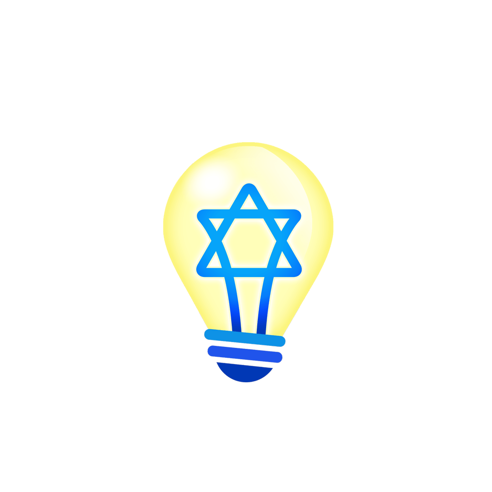

 

    

 

תמיד נדבר עברית אך ננהל פה את הדברים באנגלית!

A curated list driven by you! of awesome innovative Israeli innovations and ideas for innovation in Israel.

List inspired by the [awesome](https://github.com/sindresorhus/awesome) list thing.

**_Driving the innovation to the people and moving the people to the innovation._**

---

# Table of Contents

- [Table of Contents](#table-of-contents)
- [We cover the following topics](#we-cover-the-following-topics)
- [Solutions](#solutions)
- [In Progress](#in-progress)
- [Ideas](#ideas)

# We cover the following topics

- Agriculture
- Artificial-Intelligence
- Automotive
- Biotechnology
- Blockchain
- Cyber-security
- Education
- Energy
- Entertainment
- Fashion
- Finance
- Food
- Health
- Human-resources
- Information-Technology
- Internet-Of-Things
- Manufacturing
- Marketing
- Media
- Medical-devices
- Mobile
- Music
- Real-estate
- Retail
- Robotics
- Transportation

# Solutions

List of innovative projects that are generally available or running in production.

# In Progress

List of innovative projects that are in progress. Links to the project's repository/wiki/website/portal/chat.

# Ideas

List of new innovative ideas or problems that need to be addressed.
